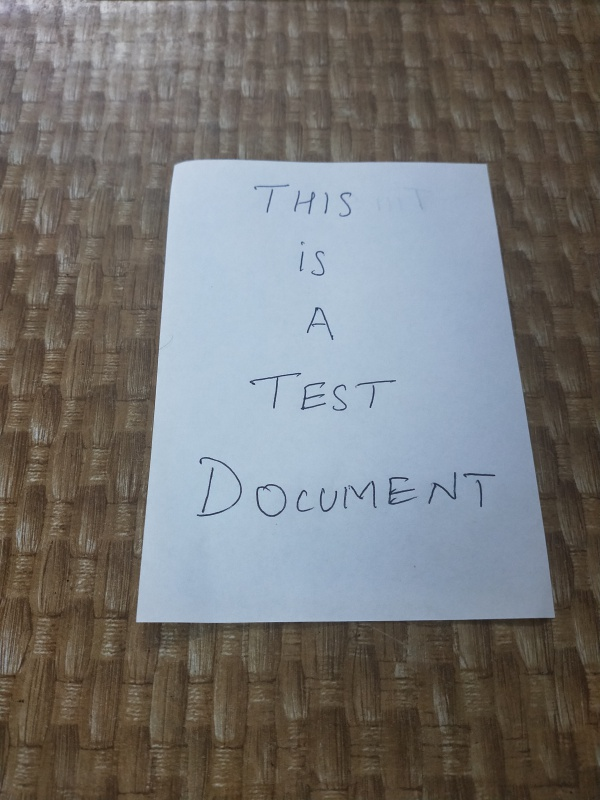
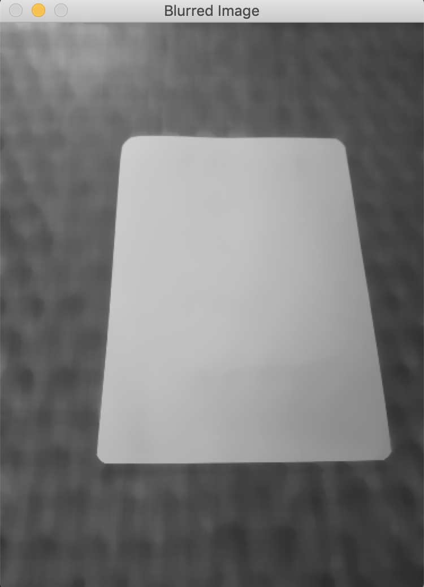
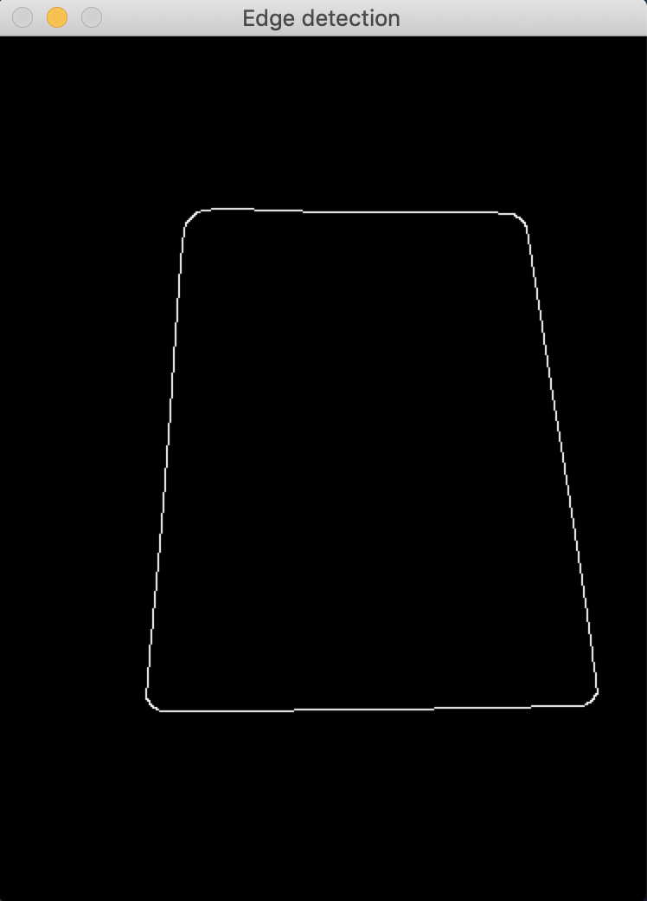
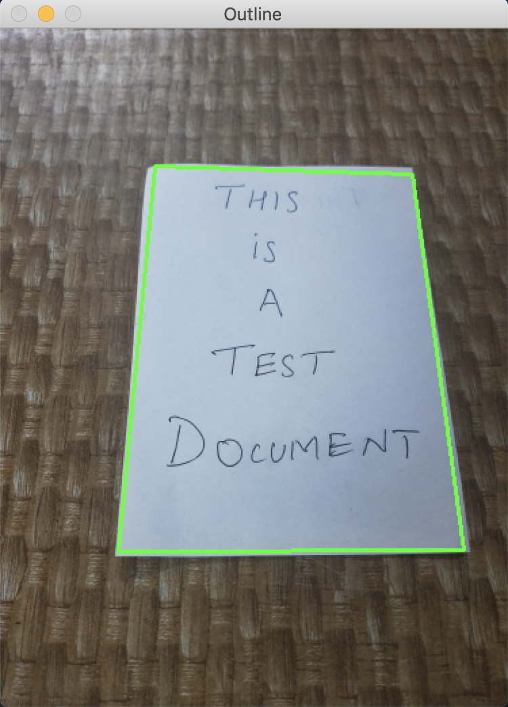
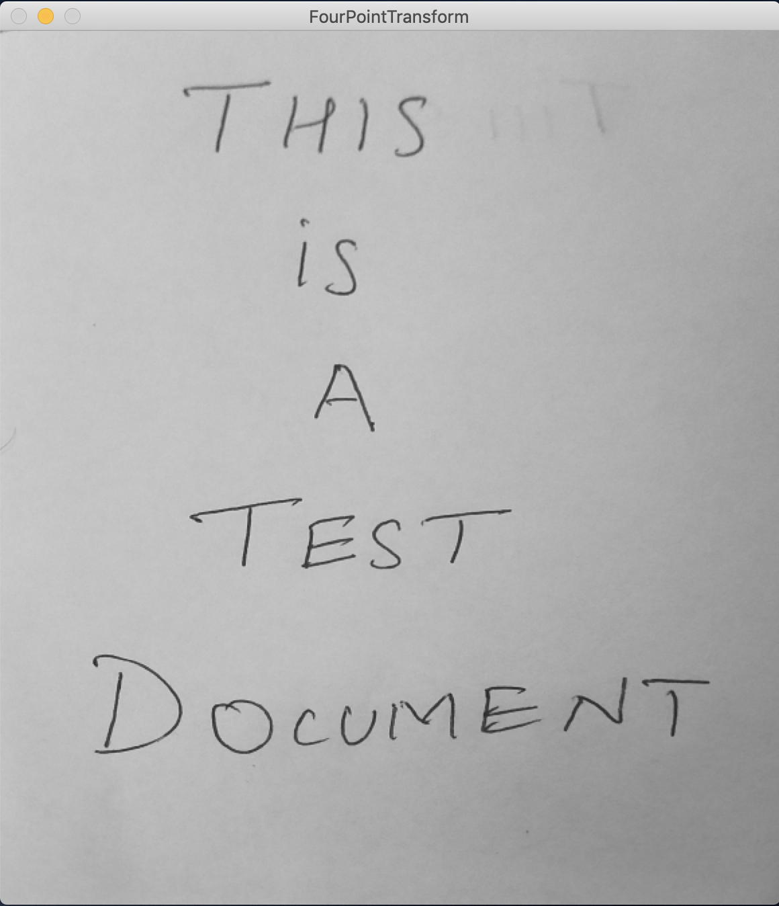
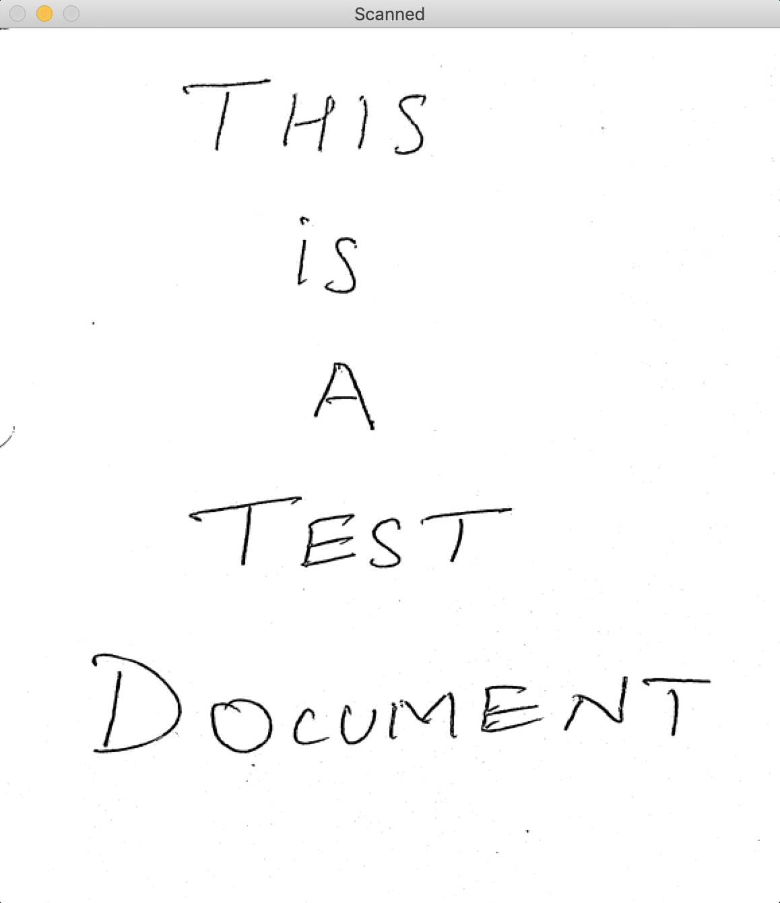

# DocumentScanner
This repo contains a document scanner which detects the document from an input image and scans it. I have also included a manual crop feature incase the document edges are not detected correctly.

`scanner.py` contains a function named `scanner` which takes jpg image as input and returns the scanned document. 

## Demo:
Below is a step-by-step demonstration of the function:

1. **Input Image:**

2. **Convert image to grayscale and apply median blurring:**

3. **Edge detection algorithm to detect the document:**

4. **Document Contours:**

If the document contours are not accurate press `1` and select four vertices of the document in the pop-up image. Else press `2` to continue.

5. **Apply four point transform for a top down view:**

6. **Thresholding:**

Apply mean thresholding to obtain the final scanned document.

**References:**
Some of the techniques in the code were sourced from https://pyimagesearch.com
